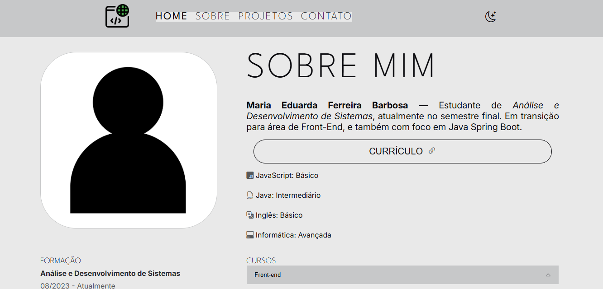

# Portfólio Pessoal — Front-End #

Este é um portfólio pessoal desenvolvido com HTML, CSS e JavaScript, criado para apresentar meus conhecimentos em desenvolvimento front-end. O projeto foi feito com foco em responsividade, acessibilidade e design adaptável, incluindo suporte a tema claro e escuro.

  

## 🛠️ Tecnologias Utilizadas
 
| HTML5:  Estrutura da página | 
| CSS3: Estilização e responsividade | 
| JavaScript: Funcionalidades interativas (como troca de tema) | 

## 📱 Funcionalidades
-  Layout responsivo para diferentes tamanhos de tela (mobile, tablet, desktop)
-  Alternância entre tema claro e escuro
-  Estrutura e Estilização modular organizada com HTML e CSS 
-  Interatividade com JavaScript vanilla

## Executar
1. Clone o repositório:
git clone https://github.com/eduarda-ferr/eduarda-ferreira-portifolio.git

3. Abra o arquivo index.html no navegador.

